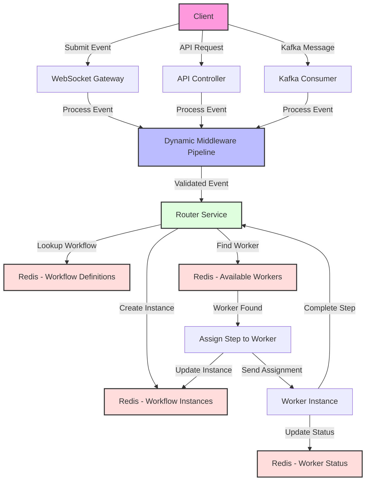
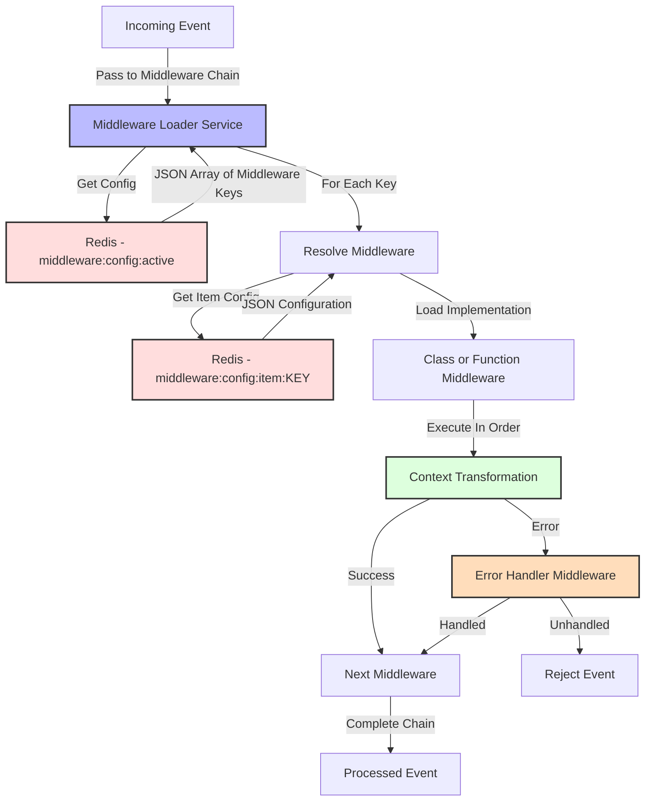
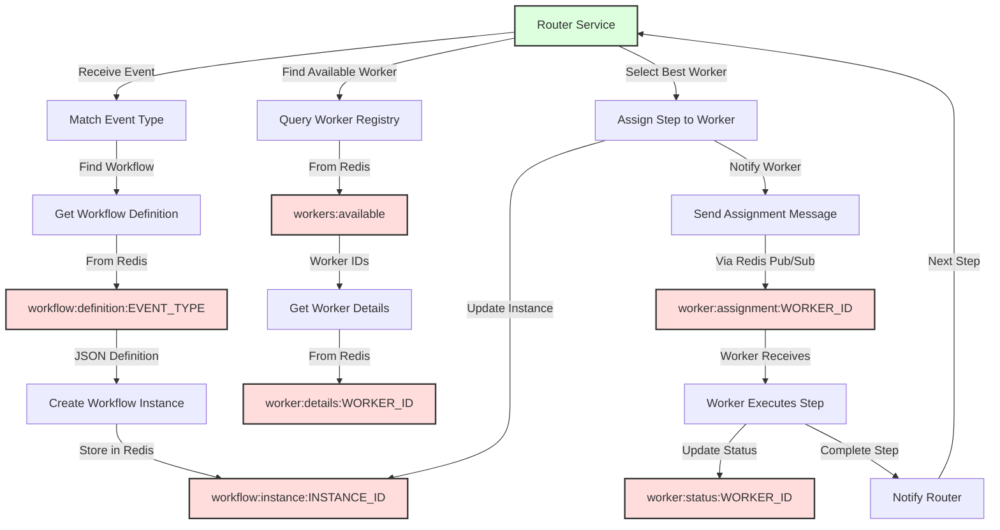

# Event Processing Flow: From Event Submission to Worker Assignment

This document provides a comprehensive overview of the event processing flow in the Crux system, starting from event submission through middleware processing to worker assignment.

## System Overview Flowchart



## Middleware Processing Detail



## Workflow Assignment Detail



## Redis Data Structures

Below are the key Redis data structures used in the system:

### Middleware Configuration

**Key: `middleware:config:active`**
```json
["authentication", "logging", "rate-limiting", "validation", "error-handling"]
```

**Key: `middleware:config:item:authentication`**
```json
{
  "key": "authentication",
  "type": "class",
  "path": "src/middleware/middlewares/authentication.middleware.ts",
  "config": {
    "jwtSecret": "your-jwt-secret",
    "expiresIn": 3600
  }
}
```

**Key: `middleware:config:list`** (Redis SET)
- "authentication"
- "logging"
- "validation"
- "rate-limiting"
- "error-handling"

### Workflow Definitions

**Key: `workflow:definition:order.create`**
```json
{
  "id": "order_processing",
  "eventType": "order.create",
  "version": 1,
  "steps": [
    {
      "id": "validate",
      "handler": "validateOrder",
      "next": "process"
    },
    {
      "id": "process",
      "handler": "processOrder",
      "next": "notify"
    },
    {
      "id": "notify",
      "handler": "notifyCustomer",
      "next": null
    }
  ]
}
```

### Workflow Instances

**Key: `workflow:instance:abc123`**
```json
{
  "id": "abc123",
  "workflowId": "order_processing",
  "eventType": "order.create",
  "status": "in-progress",
  "createdAt": "2025-10-06T12:34:56Z",
  "currentStep": "process",
  "completedSteps": ["validate"],
  "data": {
    "orderId": "ORD-12345",
    "customer": {
      "id": "CUST-6789",
      "email": "customer@example.com"
    },
    "items": [
      {"id": "PROD-101", "quantity": 2},
      {"id": "PROD-205", "quantity": 1}
    ],
    "total": 129.99
  },
  "assignedWorker": "worker-node-1"
}
```

### Worker Registry

**Key: `workers:available`** (Redis SET)
- "worker-node-1"
- "worker-node-2" 
- "worker-node-3"

**Key: `worker:details:worker-node-1`**
```json
{
  "id": "worker-node-1",
  "host": "worker-host-1.example.com",
  "capacity": 10,
  "currentLoad": 3,
  "capabilities": ["order-processing", "payment-processing"],
  "lastHeartbeat": "2025-10-06T12:45:12Z",
  "status": "active"
}
```

**Key: `worker:status:worker-node-1`**
```json
{
  "id": "worker-node-1",
  "activeJobs": 3,
  "completedJobs": 127,
  "failedJobs": 2,
  "uptime": 86400,
  "memory": {
    "free": 1024,
    "total": 4096
  },
  "cpu": 0.32
}
```

## Complete Flow Description

1. **Event Ingestion**:
   - Client submits an event through WebSocket, REST API, or Kafka
   - The event is validated for basic structure and authentication

2. **Middleware Processing**:
   - The system retrieves active middleware configuration from Redis (`middleware:config:active`)
   - Each middleware in the chain is loaded and executed in order
   - Middleware transforms or validates the event context
   - Common middleware includes: authentication, logging, rate-limiting, validation

3. **Workflow Resolution**:
   - Router service determines the event type
   - Matching workflow definition is retrieved from Redis (`workflow:definition:EVENT_TYPE`)
   - A new workflow instance is created and stored in Redis (`workflow:instance:INSTANCE_ID`)

4. **Worker Assignment**:
   - Available workers are retrieved from Redis (`workers:available`)
   - Worker details are examined to find suitable workers (`worker:details:WORKER_ID`)
   - Best matching worker is selected based on capability and load
   - Step is assigned to the worker
   - Workflow instance is updated with the assigned worker

5. **Step Execution**:
   - Worker receives the step assignment via Redis pub/sub
   - Worker executes the step logic
   - Worker updates its status in Redis (`worker:status:WORKER_ID`)
   - Worker notifies the router when step is complete

6. **Workflow Progression**:
   - Router updates the workflow instance with step completion
   - If more steps exist, the process returns to worker assignment
   - If workflow is complete, final processing and cleanup occurs
